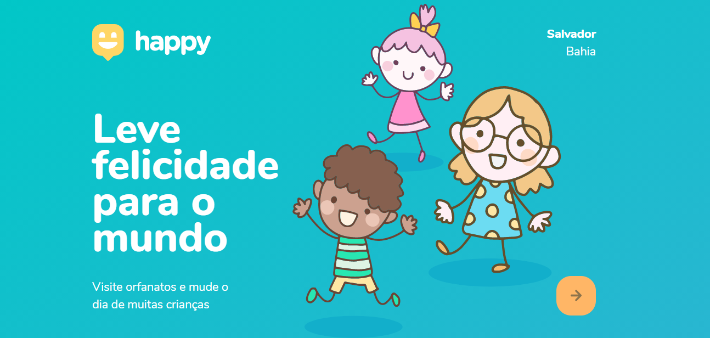

 

<h1 align="center">
    🚀 Next Level Week 3!
</h1>

  
  
  
  
  

<h2 align=center> About </h2>
 
<b>Happy</b> is a project to connect people and orphanages and provide greater interactivity of these institutions with people interested in share love and affection to children and making their days happier. Also this project was developed in the Next Level Week 3 track Discovery made by <a href="/github.com/Rocketseat">Rocketseat</a> during October 12th and 16th, 2020 

 
 <h3 align= "center">
  
 
 </h3>
 
 
 

### ⚙ Features
Os requisitos para o desenvolvimento foi instalação do VScode, Git e como database usamos o SQLite.
**Front end**
* HTML5
* CSS3
* JavaScript

**Back end**

* [SQLite](https://www.sqlite.org/index.html)
* [Node.js](https://nodejs.org/en/)
* JavaScript

📕 **Support & Libraries**
* [Handlebars](https://handlebarsjs.com/)
* [Leaflet](https://leafletjs.com/)
* [npm](https://www.npmjs.com/get-npm)
* express

 

### 📝 License
This project is under MIT license. Check the [LICENSE](LICENSE.md) file for more details.
